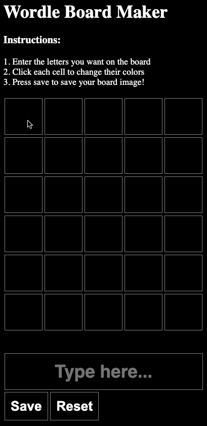

# Wordle Board Maker

This project is a simple tool to create wordle-style boards and save them as images.

# Usage

- Simply type in the input box and your board will begin automatically generating.
- Click on cells within the board to change the cell color between green, yellow, and black (default).
- Press 'Save' to save the board as an image.
- Press 'Reset' to clear the board.

# Images

